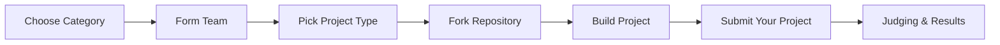

# 🚀 OpenHack'25

<div align="center">

[](https://hacktoberfest.com/)
[](./CONTRIBUTING.md)
[](./LICENSE)

[](https://github.com/OpenHack-25/Hack/graphs/contributors)
[](https://github.com/OpenHack-25/Hack/issues)
[](https://github.com/OpenHack-25/Hack/pulls)

</div>

---

## 🎯 About OpenHack'25

Welcome to **OpenHack'25** - an exciting hackathon focused on building open-source solutions for real-world challenges! Whether you're a seasoned developer or making your first contribution to open source, join us to create impactful projects in Education, Agriculture, Energy & Climate Change, or Health Care.

🗓️ **Event Date:** October 14, 2025  
👥 **Team Size:** 2-3 members  
� **Categories:** Education, Agriculture, Energy & Climate Change, Health Care  
�🌟 **Focus:** Open source solutions for real-world problems

## 📋 Table of Contents

- [About OpenHack'25](#about-openhack25)
- [Table of Contents](#table-of-contents)
- [Quick Start](#quick-start)
- [Rules & Guidelines](#rules--guidelines)
- [How It Works](#how-it-works)
- [Judging Criteria](#judging-criteria)
- [Categories & Project Types](#categories--project-types)
- [For Beginners](#for-beginners)
- [FAQ](#faq)
- [Resources](#resources)
- [Code of Conduct](#code-of-conduct)
- [Getting Help](#getting-help)

---

## Quick Start

### Prerequisites
- Laptop with development environment set up
- Fully charged battery (bring your charger!)
- GitHub account
- Git installed on your machine

### Getting Started
1. **Fork this repository**
   ```bash
   # Click the "Fork" button at the top of this page
   ```

2. **Clone your fork**
   ```bash
   git clone https://github.com/YOUR-USERNAME/Hack.git
   cd Hack
   ```

3. **Create a feature branch**
   ```bash
   git checkout -b feature/my-awesome-project
   ```

4. **Make your changes**
   ```bash
   # Build something amazing!
   git add .
   git commit -m "✨ Add my awesome feature"
   ```

5. **Push to your fork**
   ```bash
   git push origin feature/my-awesome-project
   ```

6. **Create a Pull Request**
   - Go to your fork on GitHub
   - Click "New Pull Request"
   - Submit your project folder with complete solution and documentation

📊 **Presentation Materials:** PPT and visuals will be collected through a separate form link provided during the event

📖 For detailed guidelines, see [CONTRIBUTING.md](./CONTRIBUTING.md)

---

## Rules & Guidelines

### Team Requirements
- **Team Size:** Minimum 2 members, maximum 3 members
- **One Team Only:** You can only join one team
- **No Changes:** Once registration closes, no team changes are allowed

### Event Requirements
- **Bring Your Gear:** Laptop required (fully charged!)
- **Stay Focused:** Work on your hackathon project during the event
- **Be Respectful:** Follow our [Code of Conduct](./CODE_OF_CONDUCT.md)

### Submission Requirements
- � **Create Project Folder:** Create a dedicated folder for your solution in this repository
- 🔄 **Submit Pull Request:** Submit your code via Pull Request to this repository
- � **Open Source:** Projects must be open source (see our license options)
- 🎯 **Category Focus:** Projects must fit within one of the 4 designated categories
- 🛠️ **Project Type:** Choose from Mobile App, Web App, Developer Tools, or other creative solutions
- 📊 **Presentation Materials:** PPT and visuals will be collected through a separate form

> ⚠️ **Important:** Organizers reserve the right to disqualify teams for unsportsmanlike behavior.

---

## How It Works



### Step-by-Step Process

1. **Choose Your Category**
   - Select from 4 categories: Education, Agriculture, Energy & Climate Change, or Health Care
   - Review [THEMES.md](./THEMES.md) for detailed guidance and inspiration

2. **Form Your Team**
   - Find 1-2 teammates (2-3 total members)
   - Register your team before the deadline

3. **Pick Your Project Type**
   - Mobile App, Web App, Developer Tools, or any other creative solution
   - Focus on solving real problems in your chosen category

4. **Build Your Project**
   - Fork this repository
   - Create a dedicated folder for your project solution
   - Follow open source best practices

5. **Submit Your Work**
   - Submit your code via Pull Request to this repository
   - Presentation materials (PPT/visuals) will be collected through a separate form
   - Include clear project documentation in your folder

6. **Await Results**
   - Judges will evaluate all submissions
   - Winners announced after evaluation period

---

## Judging Criteria

Projects will be evaluated based on the following criteria:

| Main Criteria | Weight | Sub-Criteria | Sub-Weight | Description |
|---------------|--------|--------------|------------|-------------|
| **Uniqueness** | 15% | Application of Technologies | 50% | How innovative is the use of technology |
|  |  | Innovation | 50% | Originality and creative approach |
| **Proof of Concept** | 15% | Understanding of Problem to be Solved | 50% | Clarity of problem definition and solution approach |
|  |  | Understanding of Business Environment | 50% | Market awareness and business viability |
| **Functionalities and Features** | 15% | User Requirements | 50% | How well the solution meets user needs |
|  |  | Compatibility and Interoperability | 50% | Technical integration and system compatibility |
| **Quality** | 30% | Content & Standards | 60% | Code quality, documentation, and adherence to standards |
|  |  | Product Stability & Reliability | 40% | Performance, error handling, and robustness |
| **Creativity & Code Quality** | 25% | Originality and Innovation of the Idea | 50% | Creative problem-solving and unique approach |
|  |  | Clean, Well-documented, Maintainable Code | 50% | Code organization, comments, and maintainability |

### Additional Considerations
- **User Experience:** How intuitive and polished is your project?
- **Technical Implementation:** Complexity and technical excellence
- **Documentation:** README, comments, and setup instructions
- **Demo Quality:** How well you present your project

---

## Categories & Project Types

At OpenHack'25, all projects must fit within one of these **4 categories**:

### 📚 **Education**
Build solutions that enhance learning, teaching, or educational access

### 🌱 **Agriculture** 
Create tools for farming, food security, or agricultural innovation

### 🌍 **Energy and Climate Change**
Develop solutions for sustainability, renewable energy, or environmental challenges

### � **Health Care**
Design tools for health monitoring, medical access, or wellness improvement

### Project Implementation Types
Choose how you'll build your solution:
- 📱 **Mobile App** — iOS, Android, or cross-platform applications
- � **Web App** — Websites, web services, or browser-based tools  
- 🛠️ **Developer Tools** — CLI tools, plugins, frameworks, or libraries
- 🎨 **Other Creative Solutions** — Games, hardware projects, or innovative approaches

> 💡 **Explore the full details and inspiration in [THEMES.md](./THEMES.md)**

---

## For Beginners

New to open source? Welcome! We're excited to have you join us. 🎉

### Mentorship
- Mentors are available throughout the event
- Ask questions in [Discussions](https://github.com/OpenHack-25/Hack/discussions)
- Don't hesitate to reach out for help!

---

## FAQ

<details>
<summary><strong>When is the hackathon?</strong></summary>
<br>
OpenHack'25 takes place on <strong>October 14, 2025</strong>. More details about timing will be shared with registered participants.
</details>

<details>
<summary><strong>Do I need programming experience?</strong></summary>
<br>
Not necessarily! While programming skills are helpful, we welcome designers, project managers, and anyone interested in open source. Teams often benefit from diverse skill sets.
</details>

<details>
<summary><strong>What should I bring?</strong></summary>
<br>
<ul>
<li>Laptop with your preferred development environment</li>
<li>Charger and any necessary cables</li>
<li>Notebook and pen for planning</li>
<li>Your favorite beverages and snacks</li>
</ul>
</details>

<details>
<summary><strong>Can I work on an existing project?</strong></summary>
<br>
The hackathon is for creating new open source projects within the designated categories. However, you can build upon existing open source tools and libraries as dependencies.
</details>

<details>
<summary><strong>How do I find teammates?</strong></summary>
<br>
Use our <a href="https://github.com/OpenHack-25/Hack/discussions">Discussions</a> tab to connect with other participants looking for teammates!
</details>

<details>
<summary><strong>What if I can't finish my project?</strong></summary>
<br>
That's perfectly fine! The goal is to learn, collaborate, and have fun. Submit what you have - judges appreciate effort and creativity over completion.
</details>

<details>
<summary><strong>How do I submit my project?</strong></summary>
<br>
<ol>
<li>Create a dedicated folder for your project in this repository</li>
<li>Submit your code via Pull Request</li>
<li>Submit your presentation materials (PPT/visuals) through the form link provided during the event</li>
<li>Include clear documentation and setup instructions in your project folder</li>
</ol>
</details>

---

## Resources

### Essential Reading
- [**CONTRIBUTING.md**](./CONTRIBUTING.md) — How to contribute to this repository
- [**CODE_OF_CONDUCT.md**](./CODE_OF_CONDUCT.md) — Community guidelines
- [**THEMES.md**](./THEMES.md) — Project ideas and inspiration
- [**LICENSE**](./LICENSE) — MIT License details

### Helpful Tools
- [GitHub Desktop](https://desktop.github.com/) — GUI for Git
- [VS Code](https://code.visualstudio.com/) — Popular code editor
- [Figma](https://figma.com/) — Design and prototyping
- [Miro](https://miro.com/) — Collaborative planning

### Learning Resources
- [freeCodeCamp](https://freecodecamp.org/) — Free coding tutorials
- [MDN Web Docs](https://developer.mozilla.org/) — Web development reference
- [Python.org](https://python.org/) — Python programming resources
- [React Docs](https://react.dev/) — React development guide

---

## Code of Conduct

We are committed to providing a welcoming and inclusive environment for all participants. Please read our [Code of Conduct](./CODE_OF_CONDUCT.md) to understand our community standards.

**Key principles:**
- **Be inclusive** — Welcome people of all backgrounds
- **Be respectful** — Treat everyone with kindness
- **Be collaborative** — Help others succeed
- **Be learning-focused** — Share knowledge and learn together

---

## Getting Help

Need assistance? We're here to help! 

### During the Hackathon
- **Ask mentors** — Available throughout the event
- **Use Discussions** — [GitHub Discussions](https://github.com/OpenHack-25/Hack/discussions)
- **Emergency contact** — Organizers will provide contact info at the event

### Before the Hackathon
- **Email us** — Contact information will be provided to registered participants
- **Join Discussions** — Ask questions in our [Discussions](https://github.com/OpenHack-25/Hack/discussions) tab
- **Follow updates** — Watch this repository for announcements

---

<div align="center">

**Ready to hack? Let's build something amazing together! 🚀**

Made with ❤️ by the OpenHack'25 team

</div>
